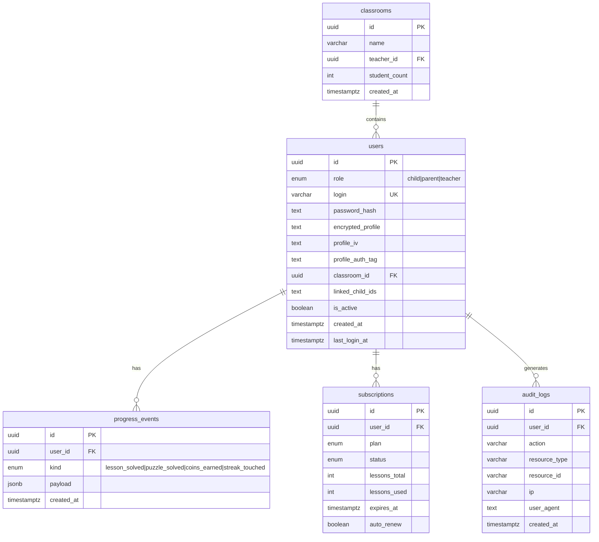

# Eduson Kids API — Architecture

## Layer Diagram

```
┌─────────────────────────────────────────────────────────┐
│                    Clients                              │
│          Web (Vite/React)   Mobile (future)             │
└─────────────────┬───────────────────────────────────────┘
                  │ HTTPS + JWT Bearer / httpOnly cookies
┌─────────────────▼───────────────────────────────────────┐
│              NestJS API (Node 22)                       │
│  ┌──────────┐ ┌──────────┐ ┌──────────┐ ┌──────────┐  │
│  │  Auth    │ │ Progress │ │Classroom │ │ Billing  │  │
│  │ Module   │ │ Module   │ │ Module   │ │ Module   │  │
│  └────┬─────┘ └────┬─────┘ └────┬─────┘ └────┬─────┘  │
│       │             │             │             │        │
│  ┌────▼─────────────▼─────────────▼─────────────▼────┐  │
│  │        Common Layer                               │  │
│  │  JwtAuthGuard │ RolesGuard │ AuditInterceptor     │  │
│  │  ValidationPipe │ ExceptionFilter │ PiiCrypto     │  │
│  └──────────────────────────────────────────────────┘  │
└────────────┬──────────────────┬───────────────────────┘
             │                  │
    ┌────────▼────────┐   ┌─────▼──────────┐
    │  PostgreSQL 16  │   │   Redis 7      │
    │  (YC MDB)       │   │  (YC MDB)      │
    │  ru-central1    │   │  Sessions      │
    │  FZ-152 ✓       │   │  Throttling    │
    └─────────────────┘   │  JWT Blacklist │
                          └────────────────┘
```

## ER Diagram (Mermaid)



## Threat Model

| # | Vector | Risk | Mitigation |
|---|--------|------|-----------|
| T1 | Credential bruteforce (child PIN) | HIGH | Rate limit 5/15min per IP; block IP after 10 failures for 1h |
| T2 | JWT token theft | HIGH | Short-lived access tokens (15m); httpOnly refresh; blacklist on logout; rotation on refresh |
| T3 | PII data breach via DB dump | HIGH | AES-256-GCM encrypted columns; key in YC Lockbox (not DB); separate KMS key rotation |
| T4 | API reverse engineering | MEDIUM | Swagger disabled in prod; no source maps; stack traces hidden; random X-API-Version header |
| T5 | SQL injection via ORM | LOW | TypeORM parameterized queries; strict DTO validation; whitelist-only input |

## Runbook

### Deploy

```bash
# 1. Build and push image
cd src/apps/api
docker build -t cr.yandex/$CR_ID/eduson-api:$VERSION .
docker push cr.yandex/$CR_ID/eduson-api:$VERSION

# 2. Deploy new revision
yc serverless container revision deploy \
  --container-name eduson-api \
  --image cr.yandex/$CR_ID/eduson-api:$VERSION \
  --service-account-id $SA_ID

# 3. Verify
curl https://YOUR_CONTAINER_URL/health
```

### Rollback

```bash
# Find previous revision
yc serverless container revision list --container-name eduson-api

# Deploy previous revision tag
yc serverless container revision deploy \
  --container-name eduson-api \
  --image cr.yandex/$CR_ID/eduson-api:PREVIOUS_VERSION \
  --service-account-id $SA_ID
```

### Run DB Migrations

```bash
# Connect via YC VPC tunnel or bastion
cd src/apps/api
DB_HOST=<postgres-fqdn> DB_SSL=true npm run migration:run
```

### Restart / Scale

```bash
# Scale container (min/max units)
yc serverless container update eduson-api \
  --min-instances 1 \
  --max-instances 20
```

### Emergency: Revoke All Sessions

```bash
# Connect to Redis
redis-cli -h $REDIS_HOST -p 6380 --tls -a $REDIS_PASSWORD
# Flush blacklist namespace (keeps throttle data)
redis-cli KEYS "blacklist:*" | xargs redis-cli DEL
# Or nuclear option:
redis-cli FLUSHDB
```
